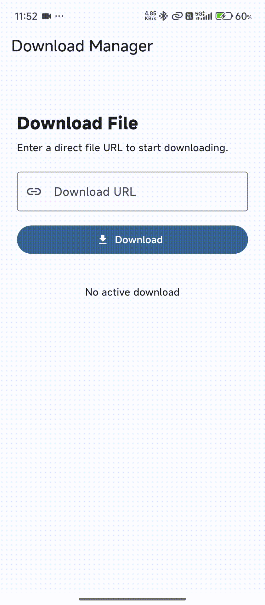

# 📥 Flutter Download Manager

[](https://pub.dev/packages/flutter_download_manager)
[](https://github.com/Excelsior-Technologies-Community/flutter_download_manager)

A customizable Flutter download manager that provides **file downloading, progress tracking, download notifications, and opening downloaded files** from a simple API.

## ✨ Features

* 📥 Download files from direct URLs
* 📊 Track download progress
* 🔔 Show Android download notifications
* ✅ Show download completion notifications
* ❌ Show download failure notifications
* 📂 Open downloaded files
* 🎯 Track individual download tasks
* 📡 Stream download state changes
* 🧩 Simple and reusable API
* 📱 Supports common downloadable file types through installed Android apps

## 📱 Demo

<p align="center">
  
</p>

## 🚀 Getting Started

Add the package to your `pubspec.yaml`:

```yaml
dependencies:
  flutter_download_manager: ^1.0.0
```

Then run:

```bash
flutter pub get
```

## 📦 Usage

Import the package:

```dart
import 'package:flutter_download_manager/flutter_download_manager.dart';
```

### Initialize the Download Manager

Create a `DownloadManager` and initialize it before starting downloads:

```dart
final DownloadManager downloadManager = DownloadManager();

await downloadManager.initialize();
```

### Start a Download

```dart
final task = await downloadManager.startDownload(
  url: 'https://example.com/sample.pdf',
  fileName: 'sample.pdf',
);
```

The returned `DownloadTask` contains information about the download:

```dart
print(task.id);
print(task.fileName);
print(task.status);
print(task.progress);
print(task.filePath);
```

### Track Download Progress

You can listen to download updates through `taskStream`:

```dart
StreamBuilder<DownloadTask>(
  stream: downloadManager.taskStream,
  builder: (context, snapshot) {
    final task = snapshot.data;

    if (task == null) {
      return const SizedBox();
    }

    return Column(
      children: [
        Text(task.fileName),
        LinearProgressIndicator(
          value: task.progress,
        ),
        Text(
          '${(task.progress * 100).toStringAsFixed(0)}%',
        ),
      ],
    );
  },
)
```

### Open a Downloaded File

After the download is completed, you can open the file using its task ID:

```dart
await downloadManager.openDownload(task.id);
```

The package uses the device's available application to open the downloaded file.

## 🔔 Download Notifications

The package provides Android notifications for download states.

### Downloading

The notification displays the current download progress:

```text
Downloading
sample.pdf • 65%
```

### Completed

After the download finishes:

```text
Download completed
sample.pdf
```

Tapping the completed notification opens the downloaded file.

### Failed

If the download fails:

```text
Download failed
sample.pdf
```

## 📋 Download Status

Each download task has a status represented by `DownloadStatus`:

```dart
enum DownloadStatus {
  pending,
  downloading,
  paused,
  completed,
  failed,
  cancelled,
}
```

You can check the current status:

```dart
if (task.status == DownloadStatus.completed) {
  await downloadManager.openDownload(task.id);
}
```

## 🧱 Package Structure

```text
lib/
├── managers/
│   └── download_manager.dart
│
├── models/
│   └── download_task.dart
│
├── services/
│   ├── download_service.dart
│   ├── file_open_service.dart
│   └── notification_service.dart
│
└── flutter_download_manager.dart
```

### DownloadManager

The main entry point for controlling downloads.

### DownloadTask

Contains the state and information of an individual download.

### DownloadService

Handles the actual file download.

### NotificationService

Manages download progress, completion, and failure notifications.

### FileOpenService

Opens completed files using the device's available application.

## ⚙️ Android Configuration

### Notification Permission

On Android versions that require notification permission, the package requests notification permission during initialization.

```dart
await downloadManager.initialize();
```

### Core Library Desugaring

The Android application using this package needs core library desugaring enabled because of the notification dependency.

In:

```text
android/app/build.gradle.kts
```

inside `android {}`:

```kotlin
compileOptions {
    isCoreLibraryDesugaringEnabled = true
}
```

Inside `dependencies {}`:

```kotlin
coreLibraryDesugaring("com.android.tools:desugar_jdk_libs:2.1.5")
```

## 📄 Supported Files

The download manager can download files from direct URLs, including common formats such as:

* PDF
* MP4
* JPG
* PNG
* ZIP
* DOC
* DOCX
* XLS
* XLSX
* APK
* Other downloadable file formats

Opening a file depends on whether a compatible application is installed on the user's device.

## ⚠️ Important

This package currently expects a **direct file URL**.

For example:

```text
https://example.com/files/sample.pdf
```

A webpage URL containing a download button is not necessarily a direct file URL.

## 🧪 Example

A complete working example is available in the `example` directory.

Run the example application with:

```bash
cd example
flutter run
```

## 📚 API Overview

| API                 | Description                   |
| ------------------- | ----------------------------- |
| `DownloadManager()` | Creates the download manager  |
| `initialize()`      | Initializes notifications     |
| `startDownload()`   | Starts a file download        |
| `taskStream`        | Streams download task updates |
| `getTask()`         | Gets a task by ID             |
| `allTasks`          | Returns all tracked tasks     |
| `openDownload()`    | Opens a completed file        |
| `removeTask()`      | Removes a task                |
| `clearCompleted()`  | Removes completed tasks       |
| `dispose()`         | Releases manager resources    |


## 📄 License

MIT License

Copyright (c) 2026 Excelsior Technologies

Permission is hereby granted, free of charge, to any person obtaining a copy
of this software and associated documentation files (the "Software"), to deal
in the Software without restriction, including without limitation the rights
to use, copy, modify, merge, publish, distribute, sublicense, and/or sell
copies of the Software, and to permit persons to whom the Software is
furnished to do so, subject to the following conditions:

The above copyright notice and this permission notice shall be included in all
copies or substantial portions of the Software.

THE SOFTWARE IS PROVIDED "AS IS", WITHOUT WARRANTY OF ANY KIND, EXPRESS OR
IMPLIED, INCLUDING BUT NOT LIMITED TO THE WARRANTIES OF MERCHANTABILITY,
FITNESS FOR A PARTICULAR PURPOSE AND NONINFRINGEMENT. IN NO EVENT SHALL THE
AUTHORS OR COPYRIGHT HOLDERS BE LIABLE FOR ANY CLAIM, DAMAGES OR OTHER
LIABILITY, WHETHER IN AN ACTION OF CONTRACT, TORT OR OTHERWISE, ARISING FROM,
OUT OF OR IN CONNECTION WITH THE SOFTWARE OR THE USE OR OTHER DEALINGS IN THE
SOFTWARE.